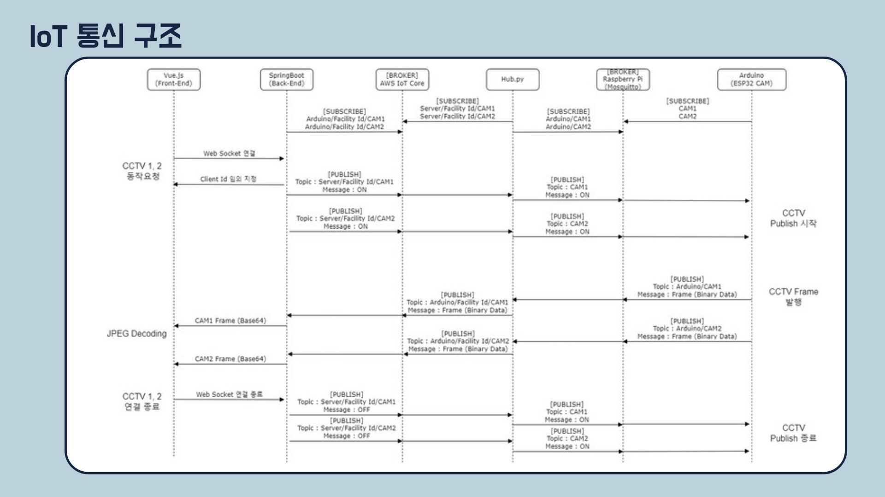
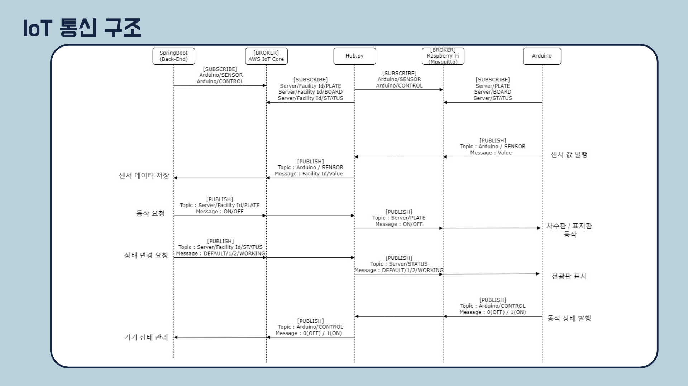

# 지하차도, 지하주차장 침수관리 통합 시스템

 

# 소개

## :boy: 팀원

| [김동현]() | [김예진]() | [황종인]() | [황윤영]() | [이효경]() | [조준희](https://github.com/jjunehee) |
| :------------------------------------------: | :------------------------------------------: | :-------------------------------------: | :------------------------------------: | :-----------------------------------: | :-----------------------------------: |
|             |              |             |            |                   |                   |
|                BackEnd                |                IoT                |            FrontEnd            |          FrontEnd BackEnd           |           BackEnd Infra            |           IoT BackEnd            |

## :balloon: 개요

**_🖐 SSAFY 9기 2학기 공통 프로젝트 🖐_**  
<h3>"세상의 모든 침수에 대응한다." 침수를 IoT 장비를 통해 감지하고 침수 피해를 예방 및 방지하는 서비스 </h3>

> 2023.07.10 ~ 2023.08.18 (6주)

 

## :sparkles: 프로젝트 기획 배경

<h3> 여름철 폭우로 인해 전국적으로 침수 피해가 끊이지 않고 있다.  앞으로 '장마'가 아닌 '우기'로 단어를 변경해야 한다는 주장도 나오고 있는 가운데, 정부에서도 침수 예방 대책을 구축, 개선 하려고 한다. </h3>

 

## :dart: WaterBell 기능 설명

### [IoT] 수위 측정
- 현장에 위치한 IoT는 부표와 적외선 센서를 이용하여 실시간 수위를 측정합니다.
- 측정된 값은 웹 서비스에 전송됩니다.

### [IoT] 현장 영상 촬영
- 현장에 위치한 IoT는 지하차도, 지하주차장 실시간 영상을 촬영합니다.
- 촬영된 영상은 웹 서비스에 전송됩니다.

### [Web] 현황판 데이터 조회
- (관리자, 사용자)는 메인, 제어페이지에서 현장 실시간 CCTV 화면을 확인합니다.
- (관리자, 사용자)는 메인 페이지에서 날씨 API를 활용한 침수지도와 강수량 그래프를 조회합니다.
- (관리자, 사용자)는 메인 페이지에서 실시간 수위 그래프를 조회합니다.

### [Web] 센서 로그 조회
- 관리자는 실시간 로그(수위, 기기 상태 및 제어, 알림)를 조회합니다.
- 수위 값이 관리자가 설정해놓은 1차, 2차 기준치가 되면 사용자에게 웹 알림, 문자가 자동으로 전송됩니다.  

### [Web] 원격 제어
- 관리자는 1,2차 침수에 따라 IoT 기기(차수판, 전광판, LED)를 제어합니다.

### [Web] 신고 접수
- 사용자는 신고 접수글 작성을 통해 관리자, 사용자에게 사실을 전파합니다.

### [Web] 마이페이지
- 관리자는 마이페이지에서 시설의 1,2차 침수 기준치와 알림 메세지를 설정합니다.

  

# :rocket: 기능 시연

### IoT

| IoT 수위 측정 |    차수판 제어  |전광판 제어|
| :--------------------------: | :-------------------------------------------------------------------------------------------------------------------------------------------------------: | :-------------------------------------------------------------: |
|   |                                                           |                              |

### 현황판

|             CCTV, 침수지도, 강수량, 수위 조회        |                          강수량 그래프                                          |                           수위센서 그래프                            |
| :--------------------------: | :--------------------------------------------------------------------------------------: | :-------------------------------------------------------------: |
|   |                                                           |                              |

### 제어, 알림

|            차수판, 전광판, LED 원격 제어            |                                  문자 알림                                           |                           웹 알림                            |
| :--------------------------: | :--------------------------------------------------------------------------------------: | :-------------------------------------------------------------: |
|   |                                                         |                              |

### 센서 내역
|  수위 센서    |     기기 상태      |       기기 제어         |       알림 로그         |
| :----------------------: | :---------------------------------------: | :--------------------------------------: |:--------------------------------------: |
|   |          |     |    |

### 신고접수

|  신고접수 글 등록시 웹알림   |  신고접수글 조회   |
| :--------------------------: | :--------------------------: |
|  |  |

|  신고접수 작성    |     신고접수 상세      |       신고접수 수정         |
| :----------------------: | :---------------------------------------: | :--------------------------------------: |
|   |         |     |

### 회원가입, 로그인

|  일반 회원가입    |     소셜 회원가입1      |       소셜 회원가입2         |
| :----------------------: | :---------------------------------------: | :--------------------------------------: |
|   |          |     |

|       소셜 회원가입3         |       소셜 회원가입4         |
| :---------------------------------------: | :--------------------------------------: |
|     |     |

## :eyes: 아키텍쳐, 산출물

### ERD

